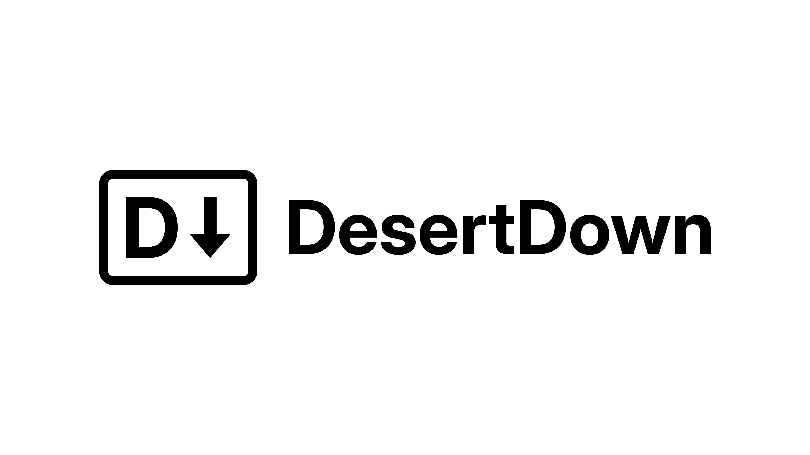

## About

DesertDown is a fast, free, flavourful markdown parser.

> [!TIP]
> For more information about the language specification, and an **interactive demo**, visit https://hfjn.co.uk/desert-down

Implemented in Rust, DesertDown is built around two deterministic finite state automata. Compared to pre-existing markdown parsers, DesertDown aims to improve the permissiveness of markdown, allowing users more control over whitespace in the output, supporting text formatting like underlining and highlighting, recognising math content, and relaxing list structure. These, among other divergences, form the "flavour" that motivates the project.

## Usage

### Build & Run

#### Input to Abstract Syntax Tree (AST)

Usage to write an AST to *standard output*:

```
cargo run --release -- <input-file>
```

Of course, one can redirect this to a file:

```
cargo run --release -- <input-file> > <output-file>
```

---

#### Input to HTML

Usage to write HTML to *standard output*:

```
cargo run --release -- <input-file> --html [--theme light|dark] [--width fixed|full] [--allow-links] [--fragment]
```

Where:

- The `--theme light|dark` (alternatively, `--light`, `--dark`) flag determines whether the HTML output uses a light or dark theme.
  - If the flag is not specified, light theming is the default.
- The `--width fixed|full` (alternatively, `--fixed-width`, `--full-width`) flag determines whether the HTML output consumes up to a fixed available width, or the full width available to it when being rendered.
  - If the flag is not specified, fixed width output is the default.
- The `--allow-links` flag enables link behaviour to be live in the output HTML. In the interest of **security**, this behaviour is **disabled by default**, as links and embeds in the output HTML form the key attack surface of the program.
  - Note that when links are enabled, *there are security measures* in place to sanitise them, but the default experience is set to be the most cautious - hence the optional flag.
- The `--fragment` flag omits the HTML header that sets the styling and Content Security Policy (CSP). In the interest of yielding the best visual results, and benefitting from the defence-in-depth implementation approach, it is **recommended to not use this flag**.
  - If the flag is not specified, full HTML document output is the default.


Of course, one can redirect this to a file:

```
cargo run --release -- <input-file> --html [--theme light|dark] [--width fixed|full] [--allow-links] [--fragment] > <output-file>
```

### Benchmarking

To run both "input to AST" and "input to AST to HTML" benchmarks:

```
cargo bench
```

To run *only* the "input to AST" benchmark:

```
cargo bench --bench time_to_ast
```

To run *only* the "input to AST to HTML" benchmark:

```
cargo bench --bench time_to_html
```

### Flamegraph

Profile, and generate a flamegraph for a benchmark using:

```
cargo flamegraph --bench <bench> -o flamegraph.svg -- --bench --profile-time 30 <bench-case>
```

Where:

- The `--bench <bench>` flag specifies which benchmark to flamegraph - use either `time_to_ast` or `time_to_html`.
- The `--profile-time 30` flag (and argument) runs the workload for 30 seconds to supply enough information for a useful flamegraph.
- The `<bench-case>` flag specifies the Criterion IDs (e.g. `Demo_50000_lines`) of cases to run
  - If this argument is not specified, every case in the bench is profiled, each for 30 seconds.

## Attribution

Full details of licensing and attribution are provided in `./LICENSE`, but the salient points are:
- The DesertDown implementation is Copyright (c) 2026, H.F.J.N.
- The DesertDown specification (https://hfjn.co.uk/desert-down), Copyright (C) 2026 H.F.J.N., is released under the Creative Commons CC-BY-SA 4.0
  - The DesertDown specification is a derivative work of the CommonMark specification, version 0.31.2 (https://spec.commonmark.org/0.31.2), Copyright (C) 2014-24 John MacFarlane, released under the Creative Commons CC-BY-SA 4.0
- The DesertDown icon, Copyright (C) 2026 H.F.J.N., is released under the Creative Commons CC-BY-SA 4.0
  - The DesertDown icon is a derivative of the Markdown Mark, created by Dustin Curtis and Mac Tyler, which is released under the Creative Commons CC0 1.0
  - The DesertDown icon also uses the Inter font (https://github.com/rsms/inter), designed by Rasmus Andersson, released under the SIL Open Font License, Version 1.1
- Markdown was originally created by John Gruber (https://daringfireball.net/projects/markdown/) and Aaron Swartz

---
---